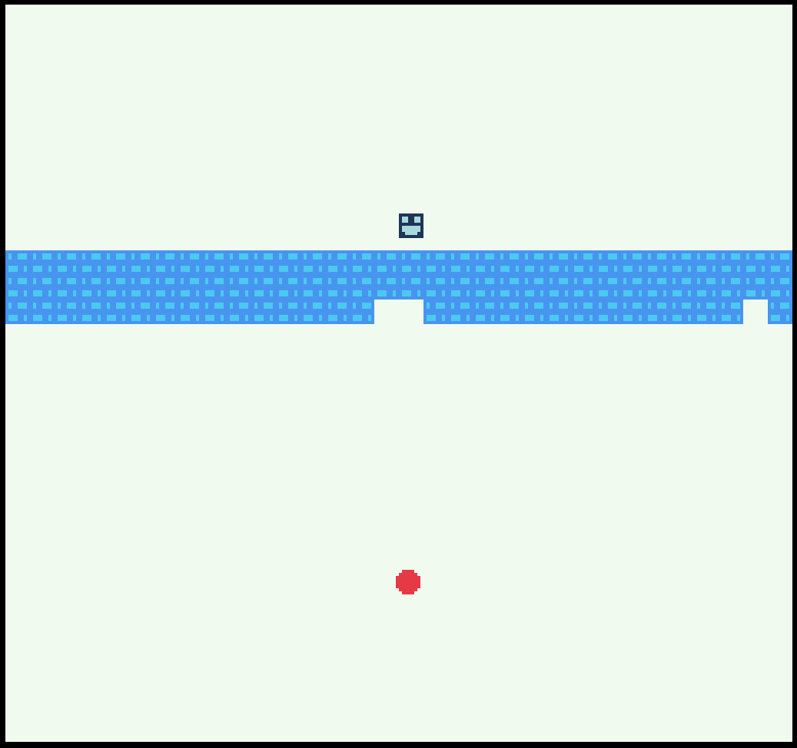

# Rick Breaker 

Author: Joshua Mathews

Design: Brick breaker but you control Rick (the Chosen One) and try to evade the ball.

Screen Shot:

How Your Asset Pipeline Works:

Raw .pngs and scripts are in the processing/ folder. Tiles are created as 8x8 .png images with 3 colors by the author. The process.py python script then processes these image (specified in script) to a binary tile format required by the PPU by setting index 1 to 3 for the first 3 colors it sees and 0 for white and then stores it in the dist/ folder. Palettes are hard coded into the code to allow for easier color scheme changes. The PlayMode code loads these assets from the binary files and sets them in the tile table.

Assets:
* Rick: 
* Rick Mortem: 
* Brick: 
* Ball: 
* End screen text: 

How To Play:

Arrow keys to move. The goal is to survive as long as possible. The ball aims towards you when it hits the top or bottom. It can't move through bricks but you can (definitely a game mechanic, not a bug). No win screens, only personal satisfaction.

This game was built with [NEST](NEST.md).
